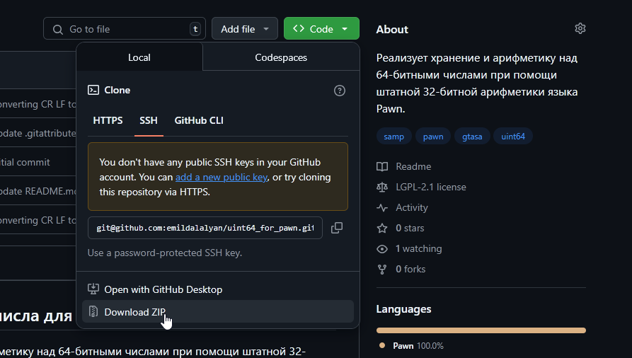
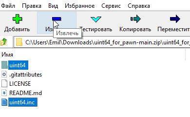
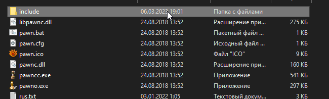
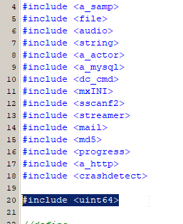
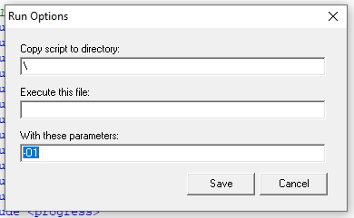
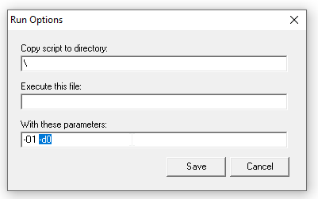

#### [<< главная](../Main.md)
## Установка и настройка

### Внимание
Данная библиотека **не работает** со штатным компилятором Pawn от проекта SA:MP! Рекомендуется использование [фанатского компилятора](https://github.com/pawn-lang/compiler), который устраняет некоторые критические ошибки.

### Установка
Далее описываются шаги скачивания и установки библиотеки:

### 1) Скачайте содержимое репозитория
<center>
    
</center>

### 2) Откройте архив
Далее проследуйте в директорию (папку) *uint64_for_pawn-main* и **извлеките директорию (папку) uint64 и файл uint64.inc**, остальное не нужно для работы библиотеки
<center>
    
</center>

### 3) Распакуйте эти файлы в директорию include вашего компилятора
По умолчанию она находится по пути *"(директория сервера)/pawno/include"*
<center>
    
</center><br>
Распаковывать нужно именно внутрь этой директории.

### 4) В коде вашего игрового режима (мода)
Напишите строчку, которая включит библиотеку в ваш код:
```pawn
#include <uint64>
```
Для удобства, сделайте это в начале кода:
<center>
    
</center>

### 5) Поздравляем! Библиотека установлена и готова к работе!
Вы можете приступать к следующему пункту документации.

<hr>

### Настройка


### Режим отладки
При включенном режиме отладки, практически все функции библиотеки изменяют переменную <code>uint64errno</code> в случае, если произошла ошибка.

Это позволяет отследить переполнение, передачу неверных аргументов, и т.д.

По умолчанию, режим отладки **выключен**, поскольку он негативно влияет на скорость некоторых операций, но его можно включить, если перед включением библиотеки написать следующее:

```pawn
#define UINT64_DEBUG 1 // <-- речь идет про эту строку

#include <uint64>
```

### Ускорение вычислений
Для большей скорости работы, рекомендуется:
1) Отключить режим отладки.
2) Включить оптимизации компилятора.
3) Отключить проверки интерпретатора.

По умолчанию, режим отладки уже **отключен**, так что для ручной настройки остаются только второй и третий пункты.

#### Включение оптимизаций компилятора Pawn

**Внимание 1:** Оптимизации компилятора могут оказаться нестабильными. Если после их включения ваш код работает непредсказуемо, то попробуйте их **выключить**.

**Внимание 2:** В редакторе qawno (проекта open.mp) по умолчанию уже включена полная оптимизация. Таким образом, этот пункт для open.mp не актуален.

Для этого необходимо дописать <code>-O1</code> в параметры компилятора (<code>-O2</code> при наличии специального JIT-интерпретатора). В редакторе pawno это можно сделать следующим образом:

<center>
    
</center>

#### Отключение проверок интерпретатора

**Внимание 1:** Отключение проверок интерпретатора (иначе говоря runtime проверок) может негативно сказаться на стабильности. При возникновении ошибок, попробуйте убрать параметр, о котором далее будет идти речь.

**Внимание 2:** В редакторе qawno (проекта open.mp) по умолчанию уже отключены проверки интерпретатора. Таким образом, этот пункт для open.mp не актуален.

Для этого необходимо дописать <code>-d0</code> в параметры компилятора. В редакторе pawno это можно сделать следующим образом:

<center>
    
</center>

### Поздравляем! Настройка завершена.
Можете вернуться на [главную](../Main.md) и начать изучать следующий пункт документации.
